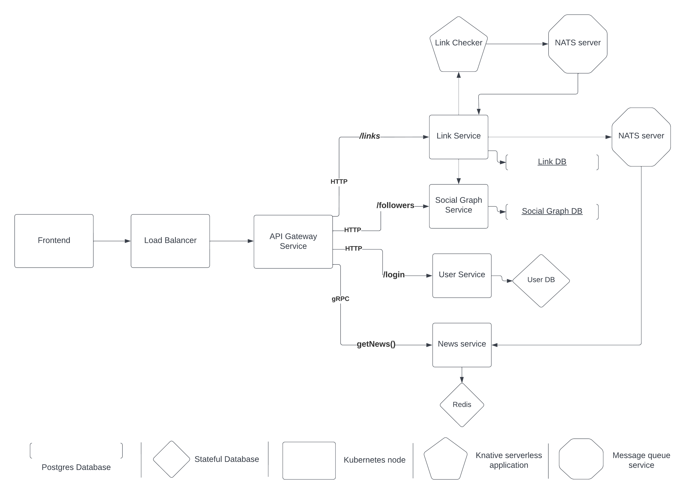

# Delinkcious
A delicious-like link management platform implemented using Go microservices

### **Why build this? What's new here?**

- I attempt to cover the development of a real-world product end to end. I have learned a lot while working on this, and I expect that to continue.
- A bigger goal is to have good onboarding documentation, and videos so that new devs benefit from it. I want them to have access to a fully working, thoroughly tested and complex product running in production. Open access to knowledge is my top priority.

### **Why choose Go?**

- Simplicity
- Strongly typed and compiled
- Compiles to a single binary with no external dependencies.
- Fast and lightweight
- Encourages good coding practices
- Excellent support for network programming and concurrency.
- Easy to deploy, implementation language of many cloud-native data stores, queues, and frameworks (including Docker and Kubernetes).
### Prerequisites
- ArgoCD (https://argo-cd.readthedocs.io/en/stable/)
- NATS (https://nats.io/)
- Nuclio (https://github.com/nuclio/nuclio)
- Telepresence (https://www.telepresence.io/)
  - Lets you run a service locally as if it's running inside your Kubernetes cluster.
- Tilt (https://tilt.dev/)
  - Gives a complete live development environment for testing on the Kubernetes.
- Go-kit/kit/log for Logging (https://github.com/go-kit/kit/tree/master/log)
- Jaeger (https://www.jaegertracing.io/)
  - For distributed tracing
  - Why?
    - Distributed transaction monitoring
    - Performance and latency optimization
    - Root cause analysis
    - Service dependency analysis
    - Distributed context propagation
- Prometheus (https://prometheus.io/)
  - For a multi-dimensional data model where each metric is modeled as a time series of key-value pairs
  - Why?
    - An open-source and CNCF graduated project
    - Powerful visualization – Grafana and console template language
- GitHub OAuth (https://docs.github.com/en/developers/apps/building-oauth-apps/authorizing-oauth-apps)

### **Why CircleCI for Continuous Integration (completely Kubernetes-agnostic)?**
- Free CI services for open source projects.
- Feature-complete and has a nicer UI, which is important.

### **Why ArgoCD for Continuous Delivery?**
- Kubernetes-aware
- Implemented on top of a general-purpose workflow engine (Argo)
- Great UI
- Runs on your Kubernetes cluster
- Implemented in Go (not important, but I like it)

**Other options for CI/CD**
- Travis CI (free for open source projects)
- Jenkins X
- Spinnaker
- Tekton
- ArgoCD
- Roll your own pipeline
### **Where is it deployed?**

It’s not deployed anywhere right now, I’m still coding the services. It’s a work in progress.
### Directory Structure

- **pkg** - The core logic is implemented by libraries in this directory

- **svc** - The microservices are in this directory. They use the excellent [gokit](https://gokit.io) microservice framework.

- **cmd** - Various utilities and one-time commands live here

- **pb** - Stands for protobuf. Contains gRPC contracts and generated code.

- **fun** - Serverless functions (Nuclio)

### **What's the high level architecture?**

- **API Gateway service** - Ingress and a Python-based API gateway service, and exposes Delinkcious to the world.
  - Provides SSL termination, authentication, and routing to multiple services.
- **NewsService** - Collects the news of newly created links from NATS and stores the key-value pairs (hot data) in an in-memory data store, Redis.
- **LinkService** - Manages links. Upon creating a new link, it triggers LinkChecker to verify the link. The successfully verified links are sent to the NATS server as an event notification to notify about the newly created link. Requests SocialGraphservice for the followers of this user.
- **LinkChecker** - Serverless function, to verify links from LinkService and pushes the status of the link to the message queue system, NATS server.
- **SocialGraphService** - Manages the followers and followings for the user.
- **UserService** - Handles users and its session.



The message queue system makes two services loosely coupled. The services are all independent of each other, each keeps doing its job regardless of what the other services do.

### Deployment strategy
- Blue-green deployment strategy fits well to deploy services where we cannot have the same service with different versions co-exist.
- Canary deployment can work if the versions of the same service can co-exist.
### Unit testing

Go to Delinkcious root directory and type: `ginkgo -r`

You should see something like:

```
[1556557699] LinkChecker Suite - 2/2 specs •• SUCCESS! 1.57716233s PASS
[1556557699] LinkManager Suite - 8/8 specs 2019/04/29 10:08:30 DB host: localhost DB port: 5432
•••••••• SUCCESS! 95.435161ms PASS
[1556557699] NewsManager Suite - 1/1 specs • SUCCESS! 322.678µs PASS
[1556557699] SocialGraphManager Suite - 6/6 specs 2019/04/29 10:08:30 DB host: localhost DB port: 5432
•••••• SUCCESS! 402.274617ms PASS
[1556557699] UserManager Suite - 6/6 specs 2019/04/29 10:08:31 DB host: localhost DB port: 5432
•••••• SUCCESS! 396.859071ms PASS

Ginkgo ran 5 suites in 11.589104359s
Test Suite Passed
```

### CI/CD

For CI check out the .circleci file and build.sh

See https://circleci.com/gh/Brijeshlakkad/delinkcious/tree/master for status

For CD type: `kubectl port-forward -n argocd svc/argocd-server 8080:443`

Then browse to: https://localhost:8080


### **How can I run this locally?**

Yes, go ahead and install prerequisites, clone the repo and deploy on your own Kubernetes cluster.

### **Can I contribute to this project?**

Feel free to create a PR, I’m more than happy to review and merge it.

### **What's the long term goal for this link management?**

- Onboarding videos and documentation
- Clean code, full test coverage and minimal tech debt
- Autocomplete
- Use AWS for hosting all services
- Replace existing HTTP with gRPC
- Istio, an open source service mesh provides a coherent model with a control and data plane
- Support for indexing and search
- Terraform support
- User Activity Tracking using URLs
- React Frontend